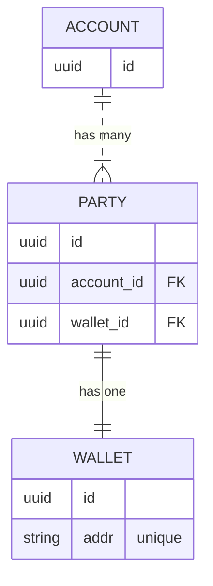

# Login system specification

This document is a specification of the login system.
 
At high-level the steps to log-in a user are:

1. Retrieve and save the CSRF tokens
2. Retrieve the nonce for the user
3. Generate the signature for the login request
4. Submit the signature to the login endpoint
5. Save the session info from the login endpoint response

To log-out a user:
1. Submit a request to logout endpoint

To add an address to a logged-in user account:
1. Generate the signature for the add address request
2. Submit the signature to add address endpoint

## Definitions

- <ins>Credentialed request</ins>: a request that uses the ["with-credentials"][1] feature of web browser HTTP requests.
  The "with-credentials" feature means that cookies for the domain are automatically saved and used in subsequent requests.

## Database schema 



When a user first signs in to the application we create an account for the user.
This account is associated to party, which is used to store profile information.
Each party has a one-to-one mapping with a wallet address.

A user can choose to associate multiple wallet addresses to a single account.
Each wallet address belongs to a unique party entity.
This means that we consider each wallet to be a separate profile.

A user can sign in to their account with any wallet that has been previously added to their account.
A user can add any address to their account as long as they prove ownership.

## Login 

### Step 1: Retrieve and save the CSRF tokens

Send a credentialed GET request to the `/csrfToken` endpoint:

```http
GET /csrfToken HTTP/1.1

HTTP/1.1 200 OK
Set-Cookie: regen-dev.x-csrf-token=b5763f7869e5cf55ca17b72629065a728661d476ce172b16a0845fac17c954ce; Path=/; HttpOnly; Secure; SameSite=Strict

{"token":"286c9007e5afe517f23afc68e2c1aff9c3c2848bc8544c94176c78bf5f9b3d7f459ff7cb132f5fedbf304bd39ced7770bd2d5c658c85cf225797aff3c6518f6c"}
```

The `token` in the JSON response body must also be saved.
The `token` and the cookie must be submitted together for all subsequent requests to the regen server.
The `token` will be submitted to the regen server in the `X-CSRF-TOKEN` header.

### Step 2: Retrieve a nonce for the user

Send a GET request to the `/web3auth/nonce` endpoint that includes the `userAddress` query parameter:

```http
GET /web3auth/nonce?userAddress=regen1yte5v5g6hez6zpplz7zffp5m5tcxajnpxpkh69 HTTP/1.1

HTTP/1.1 200 OK

{"nonce":"c5607b7d28d5236d5fb3bb4b077d178b"}
```

If the above request returns 404, then an empty string value must be used for the nonce.
This nonce must be included in the data to be signed in the next step.

### Step 3: Generate the signature for the login request

Generate the `signature` for the login request using the keplr wallet sign arbitrary API:

```javascript
  const signature = await window.keplr!.signArbitrary(
    "regen-1",
    key.bech32Address,
    JSON.stringify({
      title: 'Regen Network Login',
      description: 'This is a transaction that allows Regen Network to authenticate you with our application.',
      nonce: nonce,
    })
  );
```

Any `signature` conforming to [the `StdSignature` interface][2] and signed using Secp256k1 crypto and [ADR-036][3] should work.
Note: The data being signed must be identical between client and server, otherwise the login attempt will fail.

### Step 4: Submit the signature to the login endpoint

Send a credentialed POST request which includes the token and cookie acquired in step #1 and a JSON request body that includes the `signature`: 

```http
POST /web3auth/login HTTP/1.1
X-CSRF-TOKEN: f809ffe71aa2d11ac4bbbb5d556b02e83eba97661743df88b9ca72369d8750975902aa0845154b1f36ec21e2b0f6e6acf04c4fe881917b3494ec9592d18de6d1
Cookie: regen-dev.x-csrf-token=09b4e531ea7e540cf93f73f0d03e464ae4326f4b4b28f34268b9daaa7f23d73f

{"signature":{"pub_key":{"type":"tendermint/PubKeySecp256k1","value":"A56RnHlm6rfDLIBdEAibUtRFwXB0HNP3pVU+9V9nvlMU"},"signature":"a9A8q+C6FsroiVOcIT+641RsDu0j6uylmNMOjGGyrGRuyu8eP4AJGOzoBcbcQw1ZH2VRmGhksdFQGR0dFopOeg=="}}
```

Pending success of that request the server will respond with a new cookie that sets the user session:

```http
HTTP/1.1 200 OK

Set-Cookie: session=eyJwYXNzcG9ydCI6eyJ1c2VyIjp7ImlkIjoiMWQ5MjgzNzYtYThjMy0xMWVkLTgwNjQtMDI0MmFjMTkwMDAzIiwiYWRkcmVzcyI6InJlZ2VuMW0zajB2cjRjbHd2YTkzcmN3am5yM25qd2w2a2V1eDdxOG1qMHA0In19fQ==; path=/; expires=Wed, 15 Feb 2023 20:27:22 GMT; samesite=lax; httponly; session.sig=ibs_sNvIKpF_t5P4B99VRRSuA7w; path=/; expires=Wed, 15 Feb 2023 20:27:22 GMT; samesite=lax; httponly

{"user":{"id":"1d928376-a8c3-11ed-8064-0242ac190003","address":"regen1m3j0vr4clwva93rcwjnr3njwl6keux7q8mj0p4","nonce":"17b808de85de3316c45e3b8b2985c90a"},"message":"You have been signed in via keplr!"}
```

At this point the user is authenticated and any requests to protected endpoints will be allowed.

## Logout 

Send a credentialed POST request to the logout endpoint:

```http
POST /web3auth/logout HTTP/1.1
X-CSRF-TOKEN: f809ffe71aa2d11ac4bbbb5d556b02e83eba97661743df88b9ca72369d8750975902aa0845154b1f36ec21e2b0f6e6acf04c4fe881917b3494ec9592d18de6d1 
Cookie: regen-dev.x-csrf-token=09b4e531ea7e540cf93f73f0d03e464ae4326f4b4b28f34268b9daaa7f23d73f; session=eyJwYXNzcG9ydCI6eyJ1c2VyIjp7ImlkIjoiMWQ5MjgzNzYtYThjMy0xMWVkLTgwNjQtMDI0MmFjMTkwMDAzIiwiYWRkcmVzcyI6InJlZ2VuMW0zajB2cjRjbHd2YTkzcmN3am5yM25qd2w2a2V1eDdxOG1qMHA0In19fQ==; session.sig=ibs_sNvIKpF_t5P4B99VRRSuA7w

HTTP/1.1 200 OK
Set-Cookie: session=eyJwYXNzcG9ydCI6e319; path=/; expires=Wed, 15 Feb 2023 20:53:22 GMT; samesite=lax; httponly; session.sig=WpB-0vaD29iX-zcdgNrc9EfJUXI; path=/; expires=Wed, 15 Feb 2023 20:53:22 GMT; samesite=lax; httponly
{"message":"You have been logged out!"}
```

At this point the user is no longer allowed to make requests to protected endpoints.

## Add address

<ins>Assumption</ins>: you have already authenticated the user trying to add an address

### Step 1: generate the signature for the add address request

The data to be signed must be as follows and it must include the authenticated users nonce:
```javascript
  const signature = await window.keplr!.signArbitrary(
    "regen-1",
    key.bech32Address,
    JSON.stringify({
      title: 'Regen Network Login',
      description: 'This is a transaction that allows Regen Network to add an address to your account.',
      nonce: nonce,
    })
  );
```

The data is to be signed by the address that the user wants to add to their account.

### Step 2: submit the signature to add address endpoint

Send a credentialed POST request to the add address endpoint:

```http
POST /web3auth/addresses HTTP/1.1
X-CSRF-TOKEN: f809ffe71aa2d11ac4bbbb5d556b02e83eba97661743df88b9ca72369d8750975902aa0845154b1f36ec21e2b0f6e6acf04c4fe881917b3494ec9592d18de6d1 
Cookie: regen-dev.x-csrf-token=09b4e531ea7e540cf93f73f0d03e464ae4326f4b4b28f34268b9daaa7f23d73f; session=eyJwYXNzcG9ydCI6eyJ1c2VyIjp7ImlkIjoiMWQ5MjgzNzYtYThjMy0xMWVkLTgwNjQtMDI0MmFjMTkwMDAzIiwiYWRkcmVzcyI6InJlZ2VuMW0zajB2cjRjbHd2YTkzcmN3am5yM25qd2w2a2V1eDdxOG1qMHA0In19fQ==; session.sig=ibs_sNvIKpF_t5P4B99VRRSuA7w

{"message":"success"}
```

Now this user will be authorized to manage profiles for both of these addresses.
More generally, the user is authorized according to the row-level security policies for data associated to these addresses.

## References

- [withCredentials][1]
- [StdSignature][2]
- [ADR-036][3]
- [Real-time editor for mermaid ER diagram][4]

[1]: https://developer.mozilla.org/en-US/docs/Web/API/XMLHttpRequest/withCredentials
[2]: https://github.com/chainapsis/keplr-wallet/blob/master/packages/types/src/cosmjs.ts#L49
[3]: https://github.com/cosmos/cosmos-sdk/blame/main/docs/architecture/adr-036-arbitrary-signature.md
[4]: https://mermaid.live
